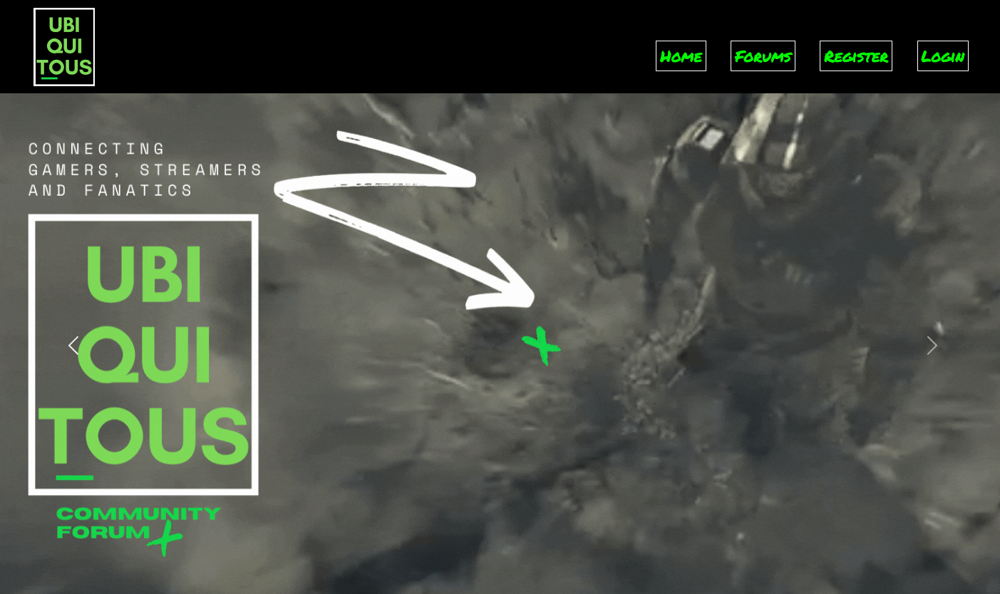

# Ubiquitous

## Description:

---
Create a community forum to track trending-up streamers, featured streams, game releases and aid in the promotion of streamer channels using the Twitch and Steam API’s.
### [Ubiquitous Homepage](https://ubiquitous-p2.herokuapp.com/)

## Table of Contents:

---
1. [Key Features](#key-features)
2. [User Story](#user-story)
3. [Breakdown](#breakdown)
4. [Contribute](#contributors)
5. [Licenses](#licenses)

## Key Features:

---

	- Tracks trending streamers on twitch
	- Includes links to contributor channels (youtube/twitch)
	- Features hero with links to steam for game releases
	- Allows users to comment and like users videos
	- Features a leaderboard that shows top trending gamers and streams
	- Links to users youtube and twitch accounts
	- Features individual user logins that stores favorite streamer content for quick access

## User Story:

---

 - AS a streamer I want a web application where I can promote my stream to a community of like-minded individuals in order to increase traffic on relevant streams.
 - WHEN I choose to sign up THEN I am prompted to create a username and password.
 - WHEN I create a profile, I can have a link to my stream that other members can view.
 - WHEN I visit the site for the first time THEN I am presented with the homepage, which includes existing community posts if any have been posted; navigation links for the homepage and the dashboard and the option to log in.
 - WHEN I click on any other link in the navigation THEN I am prompted to weather sign up or sign in.

## Breakdown:

---

 - Leverage Twitch API
 - Bridge Steam API for hero/banner
 - Forum posts:
   - Routes
   - Handlebars
 - Leaderboard
 - Nav Links
 - Profile Modal (twitch, youtube, blog, twitter?)
 - Favorites: save favorites to db (follow functionality)

## Contributors:

---
- Julian Williams
- Mike Rogers
- Evelyn Nguyen
- Nikki Mounce
- Florian Meneses
